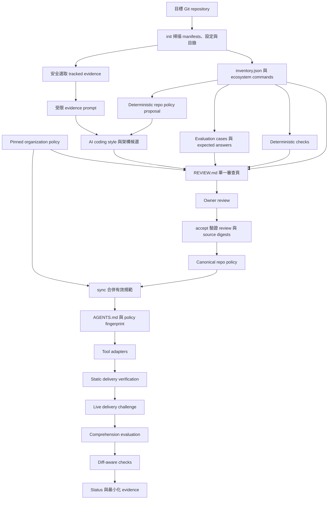

# Agent Policy Kit 現行工作邏輯

本文件說明 `agent-policy-kit` 目前已實作的工作方式、檔案責任、驗證層次與狀態判定。
它描述的是 `0.6.0` 的現行程式，不是未來 roadmap。

## 一、設計目標

系統要解決三個不同問題：

1. 同一套規範如何交給不同 AI coding agent。
2. Repository owner 如何在一個地方審查自動產生的規範、案例與 checks。
3. 如何區分「傳遞失敗」、「收到但理解錯」、「理解後仍做錯」與「證據不足」。

因此現行設計不是只建立幾份 Markdown，而是由以下四個部分共同完成：

- Canonical policy：唯一的組織與 repo 規範來源。
- Generated adapters：把相同有效規範接到不同工具。
- Review evidence：確保 owner 接受的是實際看過且沒有過期的內容。
- Independent verification：分別驗證傳遞、理解與實際產物。

## 二、整體資料流



## 三、初始化如何產生 repo 專屬內容

執行：

```bash
agent-policy-kit init
```

### 1. 確認執行邊界

工具先用 Git 找出 repository root，並要求 command 從根目錄執行。這可避免 inventory、
相對 `cwd` 與 generated files 被建立在錯誤位置。

### 2. 建立 inventory

掃描會忽略 `.git`、`.ai`、`node_modules`、`vendor`、build output、virtual environment
等不應影響判斷的目錄，並最多抽樣 5000 個檔案。

Inventory 記錄：

- Repository 名稱與初始化當下的 Git 資訊。
- Manifest、CI、測試檔案與頂層目錄。
- 既有的 agent instruction files。
- 偵測到的 ecosystems、子專案 root、commands、evidence、confidence 與 path scope。
- 是否因檔案上限而截斷。

Detector 只依 repository 內明確證據產生命令。例如 Python 專案只有在 dependency 或
設定指出 pytest、tox、nox、Ruff、mypy 時才建立對應命令；Maven 與 Gradle 優先採用
repository wrapper。初始化只識別命令，不會執行目標 repo 的 test 或 build。

### 3. 建立安全 evidence bundle

Evidence collector 只從 `git ls-files --cached` 選取已追蹤檔案，候選類型包含：

- Formatter、linter、compiler 與 build 設定。
- `CONTRIBUTING.md`、`ARCHITECTURE.md`、README 與 docs。
- 既有 agent instruction files。
- 各主要目錄的代表性原始碼與測試。

以下內容不會送給 proposal agent：

- `.env`、credential、secret、SSH key 等敏感路徑。
- PEM、keystore 等憑證副檔名。
- Binary、generated、vendor、build output 與超過限制的大檔。
- 未被 Git 追蹤的檔案。

Collector 最多選取 24 個檔案、每檔 64 KiB、每檔 8000 字元摘錄、總計 120000 字元，
並在送出前遮罩 private key、AWS access key、GitHub token 與常見 secret assignment。

`.ai/evidence/repository-profile.json` 只保存檔案路徑、分類、大小、SHA-256、截斷與遮罩
統計；原始碼摘錄只存在於該次 agent prompt，不寫入 `.ai/`。

Proposal agent 從暫存的空 Git repository 啟動，而不是目標 repository root，避免 agent
CLI 自然載入或掃描目標 repo。這是降低暴露面的措施，不是完整 security sandbox；正式
高風險環境仍需由 process sandbox 限制 filesystem 與 network。

### 4. 建立規範提案

確定性 generator 依 inventory 建立 `.ai/REPO_AGENTS.proposed.md`。每條 rule 使用穩定的
`REPO-*` ID，並包含 severity、適用範圍、requirement、evidence、verification 與
recovery。

若使用 `init --agent <tool>`，外部 agent 會收到 inventory、deterministic draft 與受限
evidence excerpts。全部內容都被標示為不可信任資料；agent 不得使用工具、讀取其他檔案、
執行命令或修改檔案。

AI 可以新增 coding style、architecture、error handling 與 testing pattern，但必須：

- 保留所有 deterministic rule IDs 與義務。
- 以反引號逐一引用 evidence bundle 中實際存在的相對路徑；任何未知路徑都會拒絕整份 AI output。
- 提供 `Confidence`、`Compliant example` 與 `Non-compliant example`。
- 只有一個樣本時標記 low confidence 與 owner confirmation。
- 不把無 deterministic checker 的推論直接標記為 `MUST`。

輸出不符合任何條件時會標記 `UNVERIFIED_OUTPUT` 並保留 deterministic draft。外部工具
不存在、執行失敗或沒有安全 evidence 時也會誠實記錄狀態，不把 fallback 偽裝成 AI proposal。

### 5. 建立 evaluations 與 checks

系統依有效 rule IDs 建立兩種驗證來源：

- `.ai/evals/cases.json`：可送給 agent 的情境題，不包含答案。
- `.ai/evals/expected.json`：只供 evaluator 評分的預期決策與 rule IDs。
- `.ai/checks.json`：對應 rules 的 builtin 或 command checks。

若 AI 候選規範包含 non-compliant example，系統會為最多四條新規範產生
`REVISE_TO_COMPLY` comprehension case。情境與 expected rule ID 仍必須由 owner 在
`REVIEW.md` 中確認。

Checks 的 command 使用 argv array，而不是 shell 字串；`cwd` 必須是 repository 內可安全
解析的相對路徑。Monorepo check 會帶有對應 path scope。

## 四、為什麼只需審查一份 REVIEW.md

初始化最後會由 `src/review.js` 讀取以下機器來源：

```text
.ai/ORG_AGENTS.md
.ai/REPO_AGENTS.proposed.md
.ai/inventory.json
.ai/project.json
.ai/policy-lock.json
.ai/init-result.json
.ai/evidence/repository-profile.json
.ai/checks.json
.ai/evals/cases.json
.ai/evals/expected.json
```

這些內容會整合成 `.ai/REVIEW.md`，依序呈現：

1. Owner 核准清單。
2. Ecosystem、子專案與命令掃描摘要。
3. Proposal agent 狀態與 evidence 選檔、截斷、遮罩、安全警告。
4. 完整 organization policy。
5. 完整 repository policy proposal。
6. 每個 evaluation case 與對應 expected answer。
7. 每個 check 的 severity、rules、command、`cwd`、path scope 與 evidence。
8. 所有機器來源的 SHA-256。

`REVIEW.md` 是 generated view，不是 canonical source。發現錯誤時應修改對應來源，再執行：

```bash
agent-policy-kit review
```

### Review 防漂移方式

`.ai/review-manifest.json` 保存：

- 每個來源檔的 SHA-256。
- 依固定順序組成的 source digest。
- `REVIEW.md` 本身的 SHA-256。
- 產生時間。

因此 `accept` 前會得到以下狀態：

| 狀態 | 判定 |
|---|---|
| `CURRENT` | 審查頁與所有來源都和 manifest 相同，可以接受 |
| `STALE` | 任一機器來源在產生審查頁後變更，必須重新產生並審查 |
| `MODIFIED` | Generated `REVIEW.md` 被直接修改，不得視為有效審查 |
| `MISSING` | 審查頁或 manifest 不存在 |
| `INVALID` | Review manifest 無法解析 |

接受時 project、evals 與 checks 會從 `NEEDS_REVIEW` 轉成 `ACTIVE`，這是系統預期的合法
變更。`.ai/review-acceptance.json` 會同時記錄接受前與接受後的 source digest，使狀態顯示
為 `ACCEPTED`，而不是錯誤地顯示 stale。接受後若來源再次變更，狀態才會回到 `STALE`。

## 五、accept 與 sync 如何建立有效規範

`agent-policy-kit accept` 會依序：

1. 驗證 proposal 存在，且含有效 `REPO-*` rule。
2. 要求 review packet 狀態為 `CURRENT`。
3. 驗證 expected answers 引用的 rule IDs 實際存在。
4. 建立或更新 `.ai/REPO_AGENTS.md`，狀態改為 `ACTIVE`。
5. 將 project 與 evaluation artifacts 標記為 `ACTIVE`。
6. 執行 `sync`。
7. 驗證並啟用 checks。
8. 寫入 review acceptance evidence。

`sync` 會驗證 organization 與 repository rule ID 不重複，再依固定順序合併：

```text
Organization policy
        ↓ 優先
Repository policy
        ↓
Root AGENTS.md
```

Policy fingerprint 是 organization 與 repository canonical Markdown 內容組合後的 SHA-256。
`.ai/generated-manifest.json` 保存 fingerprint、effective rule IDs 與 generated file hashes。

若 `AGENTS.md` 已經存在但 hash 不符合上次 generated manifest，`sync` 會停止，避免覆蓋
人工修改。只有使用者確認要捨棄該變更時才應使用 `--force`。

## 六、不同工具如何取得同一份規範

所有工具最終都指向根目錄的同一份 `AGENTS.md`：

| 工具 | 載入方式 |
|---|---|
| OpenCode | 直接讀取 `AGENTS.md` |
| Pi | 直接讀取 `AGENTS.md` |
| Codex | 直接讀取 `AGENTS.md` |
| Gemini CLI | `.gemini/settings.json` 的 `context.fileName` 設為 `AGENTS.md` |
| Claude Code | `CLAUDE.md` managed block 使用 `@AGENTS.md` 匯入 |

`setup --tool <name|all>` 會先同步規範，再建立或檢查 adapter。Gemini 的其他 settings 與
Claude managed block 以外的既有內容會保留；發現額外 context 或不完整 managed block
時則停止或提出 warning，避免無聲載入另一套規範。

## 七、三層驗證如何判斷 AI 是否遵循規範

單純存在 `AGENTS.md` 不能證明 agent 已讀取，更不能證明實作符合規範。因此現行流程把
驗證拆成三層。

### 第一層：Delivery

靜態 `verify` 檢查 adapter、generated hash、policy fingerprint 與額外 context。
`ADAPTER_READY` 只表示載入路徑看起來正確。

`verify --live` 會啟動外部 agent，要求它回覆一次性 nonce、policy fingerprint 與抽樣
rule IDs。全部精確符合才是 `CHALLENGE_CONFIRMED`；證據不足會標記 `LOAD_UNVERIFIED`，
不會推定成功。

### 第二層：Comprehension

`evaluate --live` 必須先通過 delivery challenge，之後才把 cases 交給 agent。Expected
answers 不會放進 prompt。Agent 必須選擇決策並列出 rule IDs；總分至少 90%，且 critical
case 全數正確才是 `COMPREHENSION_CONFIRMED`。

### 第三層：Artifact enforcement

`check --diff <base>` 取得 base commit 到 working tree 的 tracked diff，並加入未被 ignore
的 untracked files。它依 `when` glob 選取適用 checks，再執行：

- Generated policy integrity。
- 新增內容中的高信心 secret pattern。
- 對應 ecosystem 的 test、lint、typecheck 或 build command。

Blocker 失敗會得到 `BLOCKED` 與 exit code 2；warning 失敗得到 `WARNINGS` 但 exit code 仍為
0；`--dry-run` 只回報 `PLANNED`。

## 八、失敗診斷邏輯

| 類型 | 現行判定 | 下一步 |
|---|---|---|
| `delivery_failure` | Adapter、live nonce、fingerprint 或載入證據失敗 | 修正 setup、工具設定、啟動位置或外部 CLI |
| `interpretation_failure` | Delivery 成功，但情境答案或 rule ID 引用錯誤 | 改善規範邊界、例子或 evaluation case |
| `execution_failure` | 相同 fingerprint 的 comprehension 已通過，但實際 diff 仍違反 blocker | 修復產物，或把規範轉為更可靠的 deterministic control |
| `verification_gap` | Agent 有回應但格式、nonce 或證據不足以可靠評分 | 保持 unverified，改善證據機制，不推定成功 |
| `artifact_nonconformance` | Diff 違規，但沒有 matching comprehension evidence | 修復產物；不能據此斷言 AI 已理解後故意違反 |

這個分類讓管理者知道該調整 adapter、規範文字、執行控制或驗證方法，而不是把所有失敗
都歸因於「AI 沒照做」。

## 九、證據保存與隱私

目前證據寫在 `.ai/results/`，包含工具狀態、fingerprint、rule IDs、case IDs、check 狀態、
duration、exit code 與 output hash。系統刻意不保存：

- 完整 prompt 或對話。
- Chain-of-thought 或模型內部 reasoning。
- 原始碼 diff 副本。
- 完整 command stdout／stderr。
- 偵測到的 secret 值。

這些 evidence 目前可供本機診斷與未來 CI 串接，但尚未整合成正式 PR/MR attestation。

## 十、主要檔案責任

| 檔案或目錄 | 責任 |
|---|---|
| `src/core.js` | Inventory、proposal、accept、sync、adapters、delivery、comprehension、status |
| `src/ecosystems/` | 各語言與子專案的 manifest、command、evidence、cwd、path scope 偵測 |
| `src/evidence.js` | Tracked evidence 選檔、內容限制、secret redaction 與 proposal prompt contract |
| `src/review.js` | 單一審查頁、source digest、drift 判定與 acceptance evidence |
| `src/checks.js` | Check schema、Git diff、builtins、command execution 與 enforcement diagnosis |
| `src/cli.js` | Command routing、參數解析、人類與 JSON 輸出、exit code |
| `templates/` | 預設 organization policy 與 repo proposal 模板 |
| `test/` | Lifecycle、adapter、review、evaluation、checks 與 ecosystem 的 deterministic tests |

## 十一、目前邊界

現行工具能產生、傳遞並分層驗證規範，但仍有下列邊界：

- Markdown 是行為指示，不是權限或安全隔離。
- Live 驗證依賴外部 agent CLI 的安裝、登入與輸出格式。
- Secret builtin 只涵蓋少數高信心格式，不能取代正式 secret scanner。
- 自然語言規範衝突除重複 ID 外仍需人工判斷。
- 尚無中央 policy update bot、OpenSpec gate、waiver、PR attestation 與 CI template。

開發進度與下一階段規劃記錄在 [`PROJECT_HANDOFF.md`](./PROJECT_HANDOFF.md)，使用方式則以
repository 根目錄的 [`README.md`](../README.md) 為準。
